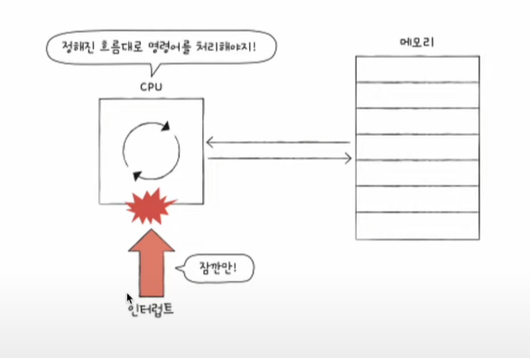

# 🗓️1주차: CPU 작동 원리 및 캐시 메모리

진행 상태: 예정됨
카테고리: 컴퓨터구조
중요도: 하
학습 기간: 2025년 11월 24일 → 2025년 11월 30일

### **🚀 학습 목표:** CPU가 명령어를 처리하는 핵심 과정과 캐시 메모리의 원리를 이해하고 설명

| 분류 | 강의 번호 | 강의명 | 면접 핵심 키워드 |
| --- | --- | --- | --- |
| **CPU 작동** | 11강 | 명령어 사이클과 인터럽트 | 명령어 사이클, 인터럽트 (개념 및 작동 순서) |
| **메모리 계층** | 17강 | 캐시 메모리 | 캐시 메모리, 지역성(Temporal/Spatial Locality), 메모리 계층 구조 |

## 11강 : 명령어 사이클과 인터럽트

### CPU - 메모리

- cpu는 메모리로부터 명령어 등 프로세스를 받아와서 실행하고, 경우에 따라 저장까지도 함

### 명령어 사이클

인출-실행의 반복

- 인출 사이클: 메모리에서 cpu 내부(레지스터)로 가져옴
- 실행 사이클: 가져온걸 실행
- 인출을 해도 바로 실행을 못하는 경우 메모리 접근을 하기 위해 간접 사이클을 만들어서 실행

### 인터럽트

사이클을 방해

- CPU가 얼른 처리해야할 다른 작업이 생겼을 때, 현재 실행 중지, 우선순위 높은 인터럽트 실행

- 동기 인터럽트: CPU가 예기치 못한 상황에서 발생
- 비동기 인터럽트: 주로 입출력 장치에 의해 발생(하드웨어 장치에서 발생, 알림같은 느낌)

### 하드웨어 인터럽트

입출력 작업 도중에도 효율적으로 명령어를 처리하기 위해 하드웨어 인터럽트 사용

⇒ 입출력동안 CPU가 다른 일을 할 수 있게 함

### 하드웨어 인터럽트의 처리 순서

- 인터럽트 요청 신호: 연결된 입출력 장치들이 지금 끼어들어도 되는지 요청
- 인터럽트 플래그: 현재 인터럽트를 받아들일 수 있는지
- 인터럽트 서비스 루틴: 인터럽트가 발생했을 때 어떻게 처리할건지 (CPU가 인터럽트를 받아들인다고 했을 때) → 메모리에 저장
- 인터럽트 벡터: 각 인터럽트를 구분하기 위한 정보(키보드 , 프린터 인터럽트 등 각 인터럽트 서비스 루틴의 시작 주소를 보유)

---

## 17강: 캐시 메모리

cpu → 메모리 접근하는 시간 < cpu 메모리 연산시간

### 저장장치 계층 구조

1. CPU와 가까운 저장장치는 빠르고, 멀리 있는 건 느림
2. 속도가 빠른 저장 장치는 저장 용량이 작고, 가격이 비싸다

⇒ 저장장치 계층 구조는 CPU에 얼마나 가까운가를 기준으로 계층이 나뉨

### 캐시 메모리: CPU와 메모리 사이에 위치한 레지스터보다 용량이 크고, 메모리 보다 빠른 SRAM 기반의 저장장

- CPU 연산속도 + 메모리 접근 속도의 차이를 조금이나마 줄이기 위해 탄생
- 메모리에서 CPU가 사용할 일부 데이터를 미리 캐시 메모리로 가져와서 쓰자!
- 물건이 많지는 않아도 집과 가까이 있는 편의점과 비슷

성능차이가 클 수 밖에 없음

### 캐시 메모리까지 반영한 저장 장치 계층 구조

### 계층적 캐시 메모리

L1, L2는 코어 내부에, L3 캐시는 코어(CPU) 외부에 위치

### 멀티코어 프로세서의 캐시 메모리

L1, L2가 서로 공유하는 경우가 있음

코어 간의 공유가 안될 수 있으므로 싱크를 맞추는 것이 중요

### 분리형 캐시

L1캐시를 조금이나마 빠르게 하려고 데이터, 명령어만 각각 담고있는 것도 있음

### 참조 지역성의 원리

- 캐시메모리는 메모리보다 용량이 작다.
- 메모리의 모든 내용을 저장할 수 없음
    
    ⇒ CPU가 자주 사용할 법한 내용을 예측하여 저장
    
    ⇒ 예측한 값을 실제로 사용한 경우: 캐시 히트 → 성능 올라감
    
    ⇒ 예측한 값이 틀린 경우: 캐시 미스 → 성능 저하
    

### 캐시 적증률 : 캐시히트횟수 / (캐시히트횟수+캐시미스횟수)

캐시 적중률을 높여야댐 (보통50~80%)

이를 높이기 위해서는 참조 지역성의 원리

### 참조 지역성의 원리: CPU가 메모리에 접근할 떄의 주된 경향을 바탕으로 만들어진 원리

- CPU는 최근에 접근했던 메모리 공간에 다시 접근하려는 경향
    
    
    
- CPU는 접근한 메모리 공간 근처를 접근하려는 경향이 있다(공간지역성)
    
    
    
    기능끼리 모여있음