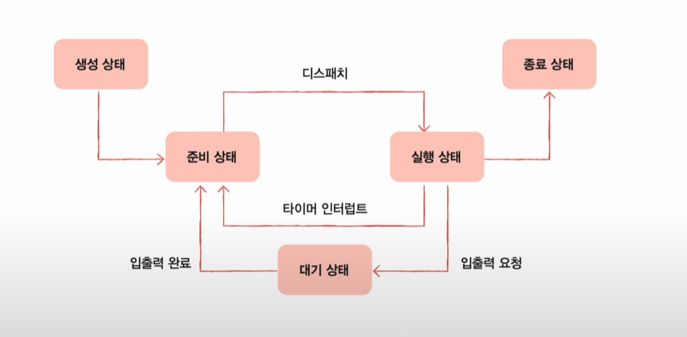

# 🗓️ 2주차: 프로세스 및 스레드

진행 상태: 예정됨
카테고리: 운영체제
중요도: 상
학습 기간: 2025년 12월 1일 → 2025년 12월 7일

### **🚀 학습 목표:** 프로세스와 스레드의 개념을 정확히 구분하고, Context Switching의 의미를 이해한다.

| 분류 | 강의 번호 | 강의명 | 면접 핵심 키워드 |
| --- | --- | --- | --- |
| **프로세스** | 27강 | 프로세스 상태와 계층 구조 | 프로세스 정의, 프로세스 상태(생성, 준비, 실행 등), Context Switching |
| **스레드** | 28강 | 스레드 | 스레드 정의, **프로세스와 스레드의 차이점 (가장 중요)**, 멀티 프로세스 vs 멀티 스레드 |

## 27강: 프로세스

### 프로세스 상태

- 생성
    - 이제 막 메모리에 적재되어 PCB를 할당 받은 상태
    - 준비가 완료되면 준비 상태로
- 준비
    - 당장이라도 CPU를 할당 받아 실행할 수 있지만
    - 자신의 차례가 아니기에 기다리는 상태
    - 자신의 차례가 된다면 실행 상태로 (디스패치)
- 실행
    - CPU를 할당 받아 실행 중인 상태
    - 할당된 시간 모두 사용시 준비상태로
    - 실행 도중 입출력 장치를 사용하면 입출력 작업이 끝날 때까지 대기상태로
- 대기
    - 프로세스가 실행 도중 입출력장치를 사용하는 경우
    - 입출력 작업은 CPU에 비해 느리기에 이 경우 대기 상태로 접어듬
    - 입출력 작업이 끝나면 준비상태로
- 종료
    - 프로세스가 종료된 상태
    - PCB, 프로세스의 메모리 영역 정리

### 프로세스 계층 구조

- 프로세스 실행 도중 다른 프로세스 생성 가능
- 새 프로세스를 생성한 프로세스 : 부모 프로세스
- 부모 프로세스에 의해 생성된 프로세스 : 자식 프로세스
    
    ⇒ 부모/자식 프로세스는 별개의 프로세스 이므로 각기 다른 PID를 가짐
    
    ⇒ 자식프로세스는 또 다른 자식 프로세스를 낳을 수 있음 → 계층적 구조 형석
    

### 최초의 프로세스 확인 : pstree

### 프로세스 생성 기법: 자식을 어떻게 만들까?

- 부모 프로세스 : fork 시스템 호출을 통해 자신의 복사본을 자식 프로세스로 생성
- 자식 프로세스 : exec 시스템 호출을 통해 자신의 메모리 공간을 다른 프로그램으로 교체
    
    ⇒ 복제와 옷 갈아입기
    

### fork 시스템 호출

### exec 시스템 호출

- 메모리 공간을 새로운 프로그램으로 덮어쓰기
- 코드/데이터 영역은 실행할 프로그램 내용으로 바뀌고 나머지 내용은 초기화

---

## 28강 : 스레드

### 스레드 : 프로세스를 구성하는 실행 흐름의 단위

하나의 프로세스는 하나 이상의 스레드를 가질 수 있음

### 프로세스와 스레드

### 스레드의 구성요소

- 스레드 ID
- 프로그램 카운터를 비롯한 레지스터 값, 스택 등
    
    ⇒ 실행에 필요한 최소한의 정보
    

⇒ 모든 스레드는 프로세스의 자원을 공유하면서 실행 됨

### 멀티 프로세스 vs 멀티 스레드

동일한 작업을 수행하는 단일 스레드 프로세스 여러개 실행 vs 하나의 프로세스를 여러 스레드로 실행

프로세스끼리는 자원공유 x, 스레드는 서로 자원 공유 o

### 멀티 프로세스와 멀티 스레드

- 프로세스를 fork하면 코드/데이터/힙 영역 등 모든 자원이 복제되어 저장됨
- 저장된 메모리 주소를 제외하면 모든 것이 동일한 프로세스 두 개가 통째로 메모리에 적재
- fork를 세 번 네 번하면 메모리에는 같은 프로세스가 통째로 세 개 네 개 적재

- 프로세스 끼리는 자원을 공유하지 않는다 → 남남처럼 독립적으로 실행된다
- 스레드는 프로세스의 자원을 공유한다. → 때로는 문제가 됨

- 프로세스간 통신(IPC)을 통해 프로세스 간에도 자원을 주고받을 수 있음
    - 파일을 통한 프로세스 간 통신, 공유 메모리를 통한 프로세스 간 통신